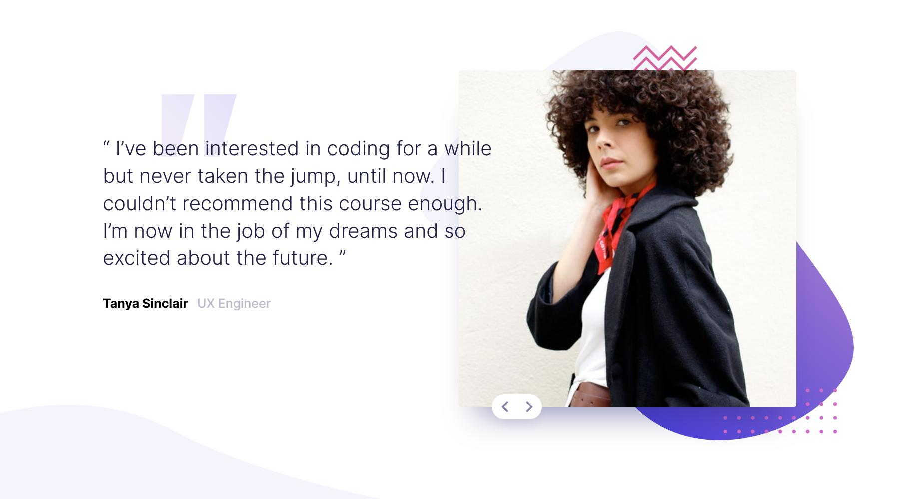

# Frontend Mentor - Coding bootcamp testimonials slider solution

This is a solution to the [Coding bootcamp testimonials slider challenge on Frontend Mentor](https://www.frontendmentor.io/challenges/coding-bootcamp-testimonials-slider-4FNyLA8JL). Frontend Mentor challenges help you improve your coding skills by building realistic projects. 

## Table of contents

- [Overview](#overview)
  - [The challenge](#the-challenge)
  - [Screenshot](#screenshot)
  - [Links](#links)
- [My process](#my-process)
  - [Built with](#built-with)
- [Author](#author)

## Overview

### The challenge

Users should be able to:

- View the optimal layout for the component depending on their device's screen size
- Navigate the slider using either their mouse/trackpad or keyboard

### Screenshot

### Links

- [Solution URL](https://github.com/thomas-simonet/frontendmentor/tree/main/05-coding-bootcamp-testimonials-slider)
- [Live site URL](https://massim-coding-bootcamp-testimonials-slider.netlify.app)

## My process

### Built with

- [Vite (Build)](https://vitejs.dev/)
- Flexbox
- SCSS
- Mobile-first workflow

## Author

- Website - [Thomas Simonet](https://thomassimonet.fr)
- Frontend Mentor - [@thomas-simonet](https://www.frontendmentor.io/profile/thomas-simonet)